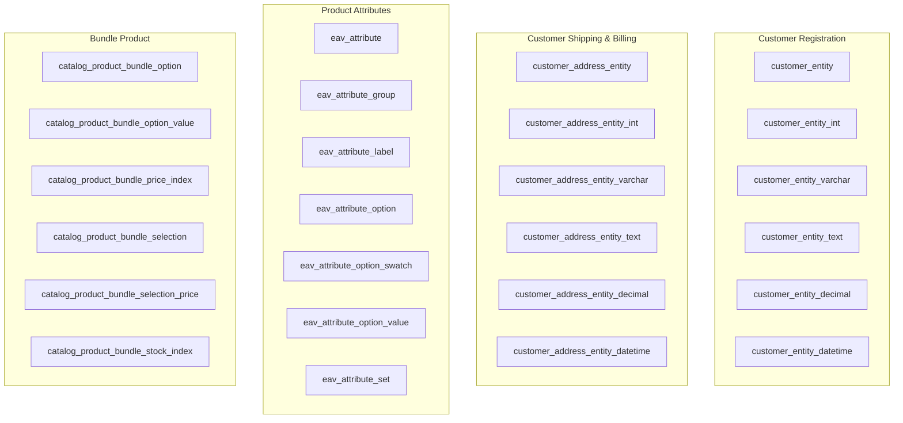
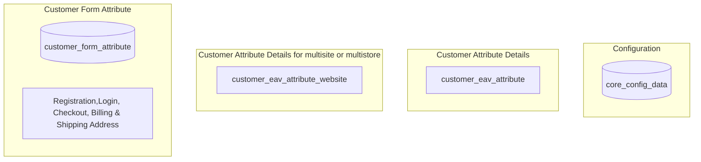
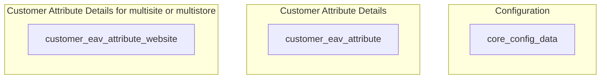

## Tables 

<!-- tabs:start -->

<!-- tab:Magento 2.3 -->

```mermaid
flowchart TB
    subgraph Customer Registration
    customer_entity
    customer_entity_int
    customer_entity_varchar
    customer_entity_text
    customer_entity_decimal
    customer_entity_datetime
    end
    subgraph Customer Shipping & Billing
    customer_address_entity
    customer_address_entity_int
    customer_address_entity_varchar
    customer_address_entity_text
    customer_address_entity_decimal
    customer_address_entity_datetime
    end
    subgraph Product Attributes
    eav_attribute
    eav_attribute_group
    eav_attribute_label
    eav_attribute_option
    eav_attribute_option_swatch
    eav_attribute_option_value
    eav_attribute_set
    end
    subgraph Bundle Product
    catalog_product_bundle_option
    catalog_product_bundle_option_value
    catalog_product_bundle_price_index
    catalog_product_bundle_selection
    catalog_product_bundle_selection_price
    catalog_product_bundle_stock_index
    end
```

```mermaid
flowchart TB
    subgraph Customer Registration
    customer_entity
    customer_entity_int
    customer_entity_varchar
    customer_entity_text
    customer_entity_decimal
    customer_entity_datetime
    end
    subgraph Customer Shipping & Billing
    customer_address_entity
    customer_address_entity_int
    customer_address_entity_varchar
    customer_address_entity_text
    customer_address_entity_decimal
    customer_address_entity_datetime
    end
    subgraph Product Attributes
    eav_attribute
    eav_attribute_group
    eav_attribute_label
    eav_attribute_option
    eav_attribute_option_swatch
    eav_attribute_option_value
    eav_attribute_set
    end
    subgraph Bundle Product
    catalog_product_bundle_option
    catalog_product_bundle_option_value
    catalog_product_bundle_price_index
    catalog_product_bundle_selection
    catalog_product_bundle_selection_price
    catalog_product_bundle_stock_index
    end
```

```mermaid
flowchart TB
    subgraph Customer Registration
    customer_entity
    customer_entity_int
    customer_entity_varchar
    customer_entity_text
    customer_entity_decimal
    customer_entity_datetime
    end
    subgraph Customer Shipping & Billing
    customer_address_entity
    customer_address_entity_int
    customer_address_entity_varchar
    customer_address_entity_text
    customer_address_entity_decimal
    customer_address_entity_datetime
    end
    subgraph Product Attributes
    eav_attribute
    eav_attribute_group
    eav_attribute_label
    eav_attribute_option
    eav_attribute_option_swatch
    eav_attribute_option_value
    eav_attribute_set
    end
    subgraph Bundle Product
    catalog_product_bundle_option
    catalog_product_bundle_option_value
    catalog_product_bundle_price_index
    catalog_product_bundle_selection
    catalog_product_bundle_selection_price
    catalog_product_bundle_stock_index
    end
```

```mermaid
flowchart TB
    subgraph Configuration
    core_config_data[(core_config_data)]
    end
    subgraph Customer Attribute Details
    customer_eav_attribute
    end
    subgraph Customer Attribute Details for multisite or multistore
    customer_eav_attribute_website
    end
    subgraph Customer Form Attribute 
    customer_form_attribute[(customer_form_attribute)]
    forms[Registration,Login, Checkout, Billing & Shipping Address]
    end
    
```

```mermaid
flowchart TB
  subgraph Configuration
    core_config_data
    end
    subgraph Customer Attribute Details
    customer_eav_attribute
    end
    subgraph Customer Attribute Details for multisite or multistore
    customer_eav_attribute_website
    end
```
<!-- tab:Magento 2.4 -->

<!-- tab:EAV Example -->

 New!

<!-- tabs:end -->
