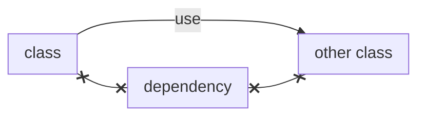
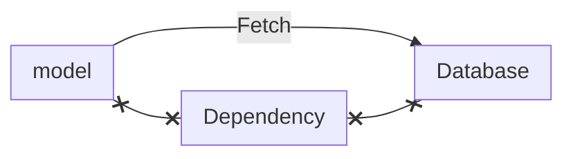
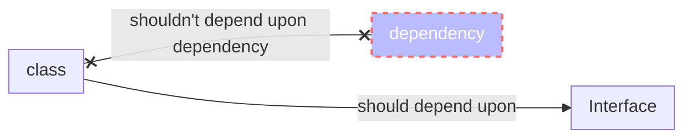

## Dependency Injection

> It's another object class needs to functions. 



## Example 

- Model  class depends upon database 



## Injecting Dependencies

Inject Dependencies means just push dependencies into class from outside. 

> you shouldn't instaniate depencies using new operation inside the class

Take dependency as constructor parameter or be a settter. As model class take database object as constructor parameter as depedency push(**inject**) .

you don't need fancy container (DIC, services container,pimple) 


```public function __construct (Database $db)```

## why

Instead of create object everytime needed 

## dependency inversion principal


it should depend upon abstract so that it decouple implmentation from dependency. It should depend upon interface.
we subtitute dependency as long as it satisfy required inteface . 

- It decouple code low-level implmentation
- Easier to modify and reuse

## Problem !

As Adopted DI, class need dependencies **we need to figure out what depedencies they need?** and **how to instantiate the dependencies?**


