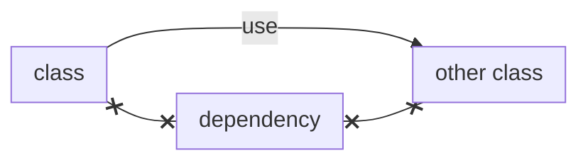
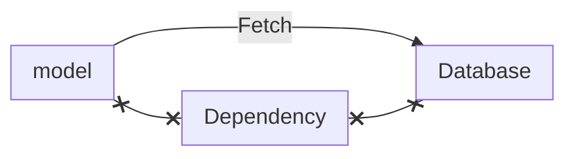
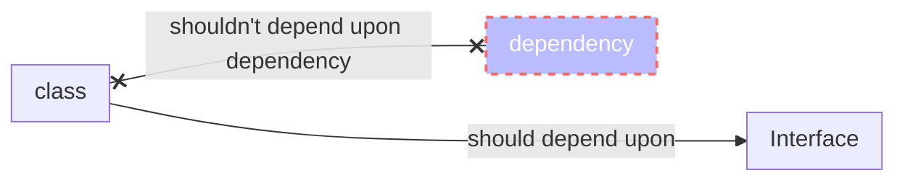
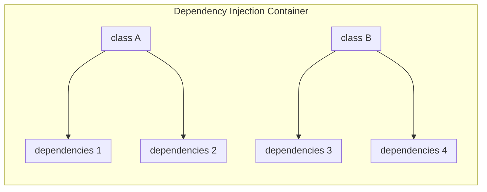
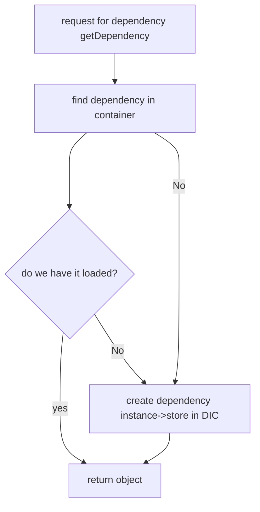

## Dependency Injection

> It's another object class needs to functions. 



## Example 

- Model  class depends upon database 



## Injecting Dependencies

Inject Dependencies means just push dependencies into class from outside(magento2 use di.xml). 

> you shouldn't instaniate depencies using new operation inside the class

Take dependency as constructor parameter or be a settter. As model class take database object as constructor parameter as depedency push(**inject**) .

you don't need fancy container (DIC, services container,pimple) 


```public function __construct (Database $db)```

## why

Instead of create object everytime needed 

## Dependency Inversion Principal


it should depend upon abstract so that it decouple implementation from dependency. It should depend upon interface.
we subtitute dependency as long as it satisfy required inteface . 

- It decouple code low-level implementation
- Easier to modify and reuse

## Problem !

As Adopted DI, class need dependencies **we need to figure out what depedencies they need?** and **how to instantiate the dependencies?**

## Solution

**Dependency Injection Container**  (Service Locator)



```
class A => array("dependencies 1","dependencies 2")
class B => array("dependencies 3","dependencies 4")
```
> It's map of dependencies class needs with logic to create those dependencies if they haven't been created yet. 

so everytime asked for dependency array map figure out which dependency to use then container check if those dependency create already if it have return object/dependency otherwise cretate dep & store and return instead of construction of all class yourself you aske container for new instance or  resolve dependency construction, object container resolve dependency transparently you need & update container(DIC). 
## Benefit

- Abstraction
- More Modular
- More Flexible


