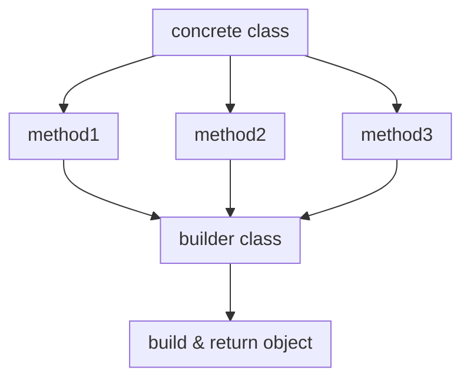

## Builder Design Pattern {Creational Pattern}
> Separates object construction from  representation.

## Intent
- Same contruction process can create different type of object and  representation.

#### A typical Builder consists of:

- Concrete class
- A builder interface
- The different builder implementations
- A director class that calls the appropriate builder and return object.

<!-- slide:break -->

## structure

<!-- slide:break -->

1. The **Builder interface** declares product construction steps that are common to all types of builders

2. **Concrete Builders** provide different implementations of the construction steps. Concrete builders may produce products that don’t follow the common interface

3. **Products** are resulting objects. Products constructed by different builders don’t have to belong to the same class hierarchy or interface

4. The **Director** class defines the order in which to call construction steps, so you can create and reuse specific configurations of products.

5. The **Client** must associate one of the builder objects with the director. Usually, it’s done just once, via parameters of the director’s constructor. Then the director uses that builder object for all further construction. However, there’s an alternative approach for when the client passes the builder object to the production method of the director. In this case, you can use a different builder each time you produce something with the director.

## Example

<!-- panels:end -->
## References
[Recfactoring](https://refactoring.guru/design-patterns/builder)

[sourcemaking](https://sourcemaking.com/design_patterns/builder)
