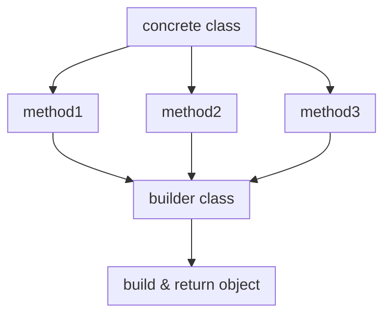

## Builder Design Pattern {Creational Pattern}
> Separates object construction from  representation.

## Intent
- Same contruction process can create different type of object and  representation.

#### A typical Builder consists of:

- Concrete class
- A builder interface
- The different builder implementations
- A director class that calls the appropriate builder and return object.

## structure

 

<!-- slide:break -->

# 

I have added:

<!-- slide:break -->

<!-- panels:start -->
1.The Builder interface declares product construction steps that are common to all types of builders.
2.
<!-- panels:end -->
## References
[Recfactoring](https://refactoring.guru/design-patterns/builder)

[sourcemaking](https://sourcemaking.com/design_patterns/builder)
