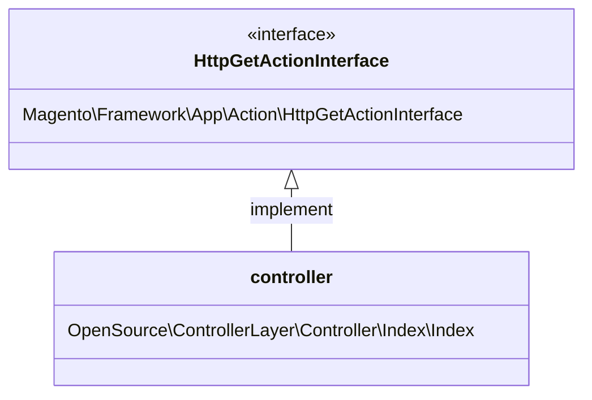

- class specific to url or group of url
- Only process a single action (group of url or single page)
- processs the request with request parameters
- start rendering process (view)
- instantiate models (Model)

```
Magento\Catalog\Controller\Product\View
```

<!-- slide:break -->



<!-- slide:break -->


