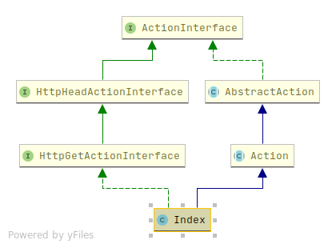
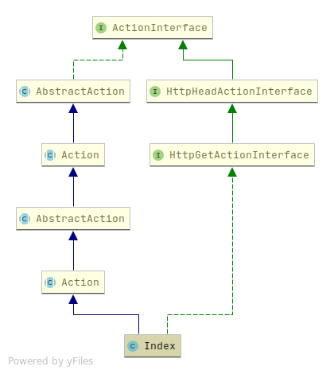
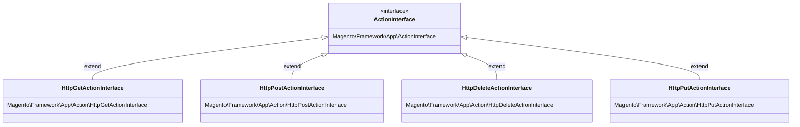
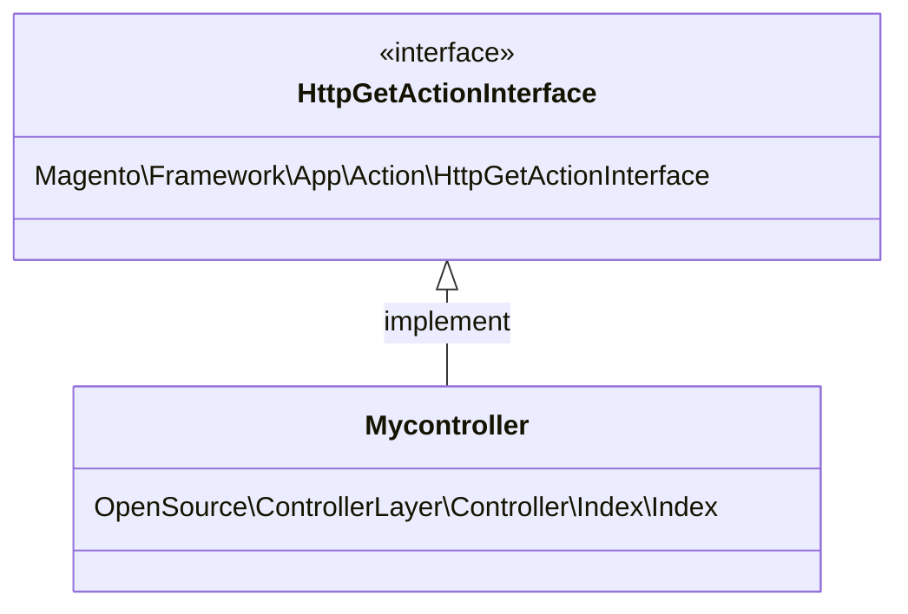

<!-- tabs:start -->

Before magento2.4, Developer need to extend ```Magento\Framework\App\Action\Action``` class. This class **context**(`\Magento\Framework\App\Action\Context`) provide following classes to handle the request type, and  validate authorised user.
```
\Magento\Framework\App\RequestInterface
\Magento\Framework\App\ResponseInterface
\Magento\Framework\ObjectManagerInterface
\Magento\Framework\Event\ManagerInterface
\Magento\Framework\UrlInterface
\Magento\Framework\App\Response\RedirectInterface
\Magento\Framework\App\ActionFlag
\Magento\Framework\App\ViewInterface
\Magento\Framework\Message\ManagerInterface
\Magento\Framework\Controller\Result\RedirectFactory
\Magento\Framework\Controller\ResultFactory 
```
this process increase executing time because need lots of object instantiation even we don't need all of them which impact performance .
Now we use composite pattern to increase performance and execution time by composite object (implementing `ActionInterface`) instead of inheritance (extend  `AbstractAction`)

<!-- tab:frontend -->

<!-- tab:backend -->


<!-- slide:break -->




<!-- slide:break -->

## Controller class
- class specific to url or group of url
- Only process a single action (group of url or single page)
- processs the request with request parameters
- start rendering process (view)
- instantiate models (Model)


```
Magento\Catalog\Controller\Product\View
```

## Benefits
- we can use only code we needed
