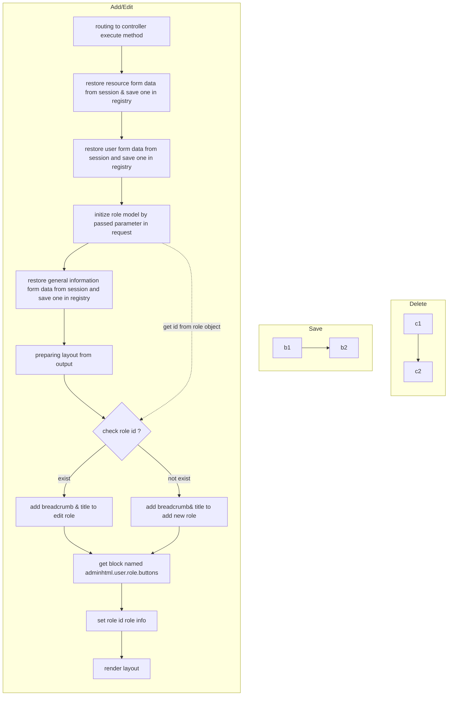

>**Notes** 
> Roles Flow

```mermaid
flowchart TB
    subgraph Delete
    direction TB
    c1-->c2
    end
    subgraph Save
    b1-->b2
    end
    subgraph Add/Edit
    direction TB
    a1[routing to controller execute method]-->a2[restore resource form data from session & save one in registry]
    a2-->a3[restore user form data from session and save one in registry]
    a3-->a4[initize role model by passed parameter in request]
    a4-->a5[restore general information form data from session and save one in registry]
    a5-->a6[preparing layout from output]
    a6-->a7{check role id ?}
    a4-. get id from role object .-> a7
    a7-->|exist| a8[add breadcrumb & title to edit role]
    a7-->|not exist| a9[add breadcrumb& title to add new role]
    a8 & a9-->a10[get block named adminhtml.user.role.buttons]-->a11[set role id role info]
    a11-->a12[render layout]
    click a2 "https://github.com" "Magento\User\Controller\Adminhtml\User\Role\EditRole" _blank
    end
    
```
