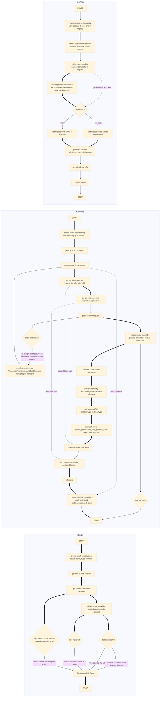

> **Note** 
> Roles Flow

```mermaid
%%{init: {'theme':'base'}}%%
flowchart LR
    subgraph Delete
    direction TB
    delete[START]
    ==>redirect[create result object using resultFactory type `redirect`]
    ==>getRoleId[get role id from request]
    ==>currentUser[get current user from session]
    ==>sameRoles{req delete for role exist in cureent user roles array}-->|cannot delete self-assigned roles |redirectEditPage
    currentUser
    ==>_initRoledel[nitialize role model by passed parameter in request]
    ==>roleCheck{role not exist}-->|We can not find a role to delete| redirectEditPage
    _initRoledel
    ==>deleteWithOutError{delte sucessfully}--> |You deleted the role | redirectEditPage
    deleteWithOutError-->|An error occurred while deleting this role| redirectEditPage
    redirectEditPage[Redirect to Edit Page]
    ==>stopDelete[STOP]
    
    end
    
    subgraph SaveRole
    direction TB
    start[START]
    ==>$resultRedirect[create result object using resultFactory type `redirect`]
    ==>$rid[get role id from request]
    ==>$resource[get resource from request]
    ==>$oldRoleUsers[get old role user from request `in_role_user_old`]
    ==>$roleUsers[get get role user from request `in_role_user`]
    -->$isAll[get isAll from request]
    -->IsALL{allow all resource}
    -->|re-assign root resource id instead of `resource id from request` | resource[rootResourceId from \Magento\Framework\Acl\RootResource using object manager]-->$resource
    $isAll==>$role[Initialize role model by passed parameter`role_id` in request]
    -->role{role not exist}-->stop[STOP]
    $role
    ==>validateUser[Validate current user password]
    ==>$roleName[get role name by removeTags from request rolename]
    $roleName
    ==>setdata[setName setPid  setRoleType setUserType ]
    ==>dispatch[dispatch event `admin_permissions_role_prepare_save` object`role` request]
    ==>processPreviousUsers[delete old user from roles]
    $oldRoleUsers-. pass old role user  .->processPreviousUsers 
    processPreviousUsers-->processCurrentUsers[Processes users to be assigned to roles]
    $roleUsers-. pass role user  .->processCurrentUsers
    $resource-. pass resource  .->rulesFactory
    processCurrentUsers
    ==>save[role save]
    ==>rulesFactory[create rulesFactory object AND setRoleId setResources AND save]
    ==>stop[STOP]
    end
    
    subgraph Add/Edit
    direction TB
    add[START]
    ==>restoreResourcesDataFromSession[restore resource form data from session & save one in registry]
    ==>restoreUsersDataFromSession[restore user form data from session and save one in registry]
    ==>_initRole[initize role model by passed parameter in request]
    ==>_initAction[restore general information form data from session and save one in registry]
    ==>roleId{role exist ?}
    _initRole-. get id from role object .-> roleId
    roleId-->|exist| editRole[add breadcrumb & title to edit role]
    roleId-->|not exist| addRole[add breadcrumb& title to add new role]
    editRole & addRole
    ==>block[get block named adminhtml.user.role.buttons]
    ==>setRole[set role id role info]
    ==>renderLayout[render layout]
    ==>z[STOP]
    end
    
```
