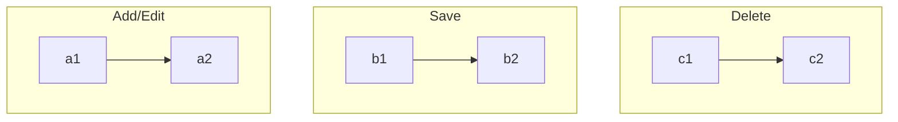
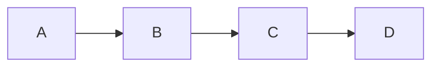

>**Notes** 
> Roles Flow

```mermaid
flowchart TB
    subgraph Delete
    c1-->c2
    end
    subgraph Save
    b1-->b2
    end
    subgraph Add/Edit
    a1-->a2
    click a1 callback "Magento\User\Controller\Adminhtml\User\Role\EditRole"
    click a2 callback "Magento\User\Controller\Adminhtml\User\Role\EditRole"
    click a1 call callback() "Magento\User\Controller\Adminhtml\User\Role\EditRole"
    end
```

```mermaid
flowchart LR
    A-->B
    B-->C
    C-->D
    click A callback "Tooltip for a callback"
    click B "https://www.github.com" "This is a tooltip for a link"
    click A call callback() "Tooltip for a callback"
    click B href "https://www.github.com" "This is a tooltip for a link"
```
